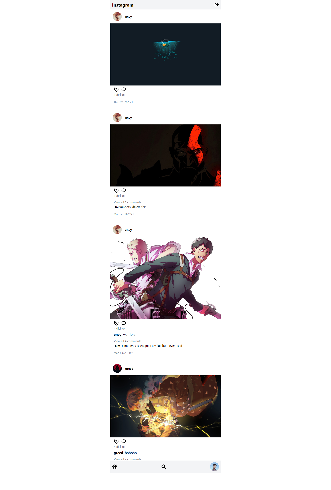

# Instagram Clone

- [Live Demo](https://instagram-clone-b7e9f.web.app/)
- A simple Instagram clone with basics features.
- This project took me a lot of time to complete, but I learned a lot in the process.
- This project has some bugs that I am having trouble debugging currently but I will fix these issues after learning a bit more.

## Tech Stack

- React
- Firebase
- TailwindCSS

## How to run?

1. Create a new project in firebase.
2. Configure the web app by putting your firebase configs in the .env.local file.
3. Then simply run npm install && npm start in the terminal and it should work.

## Resources
1. React Docs
2. Firebase Docs
3. [I learned how to upload image to firebase by watching this video.](https://www.youtube.com/watch?v=f7T48W0cwXM&t=11287s)
